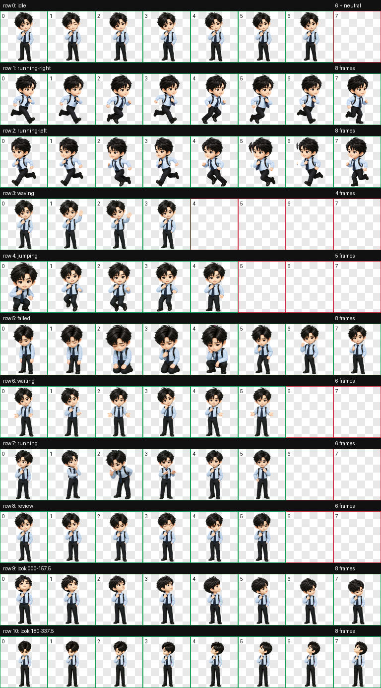
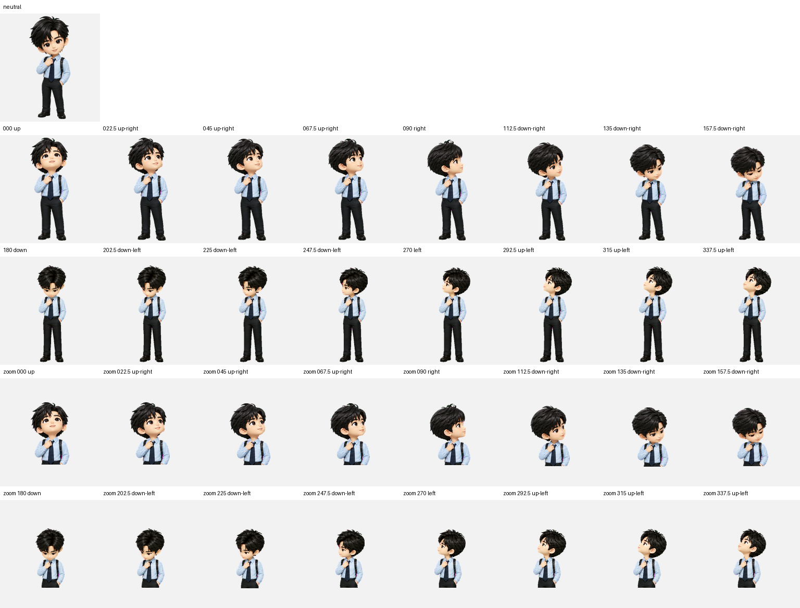

# Codex Token Bar

Native macOS menu bar app for OpenAI Codex: tracks token usage, rate limits, reset time, context window, and cached tokens from local Codex logs. Includes a draggable floating usage badge that follows your Codex desktop pet. Private, local-first, no API key.

一个完全本地运行的原生 macOS 菜单栏应用：在菜单栏显示 Codex 主额度剩余比例，并在 Codex 桌面宠物旁显示一个会跟随移动的余额浮标。

这是一个独立的 macOS 应用项目，而不是 Codex Skill。它需要长期运行、创建透明浮层窗口、读取本机 Codex 会话日志，并调用 Codex App Server；这些都超出了 Skill 作为“给模型的工作说明”的合适边界。

## 功能

- 菜单栏显示 Codex 主额度的环形进度与剩余百分比。
- 展开面板显示重置时间、本任务 Token、最近一次调用、缓存复用与上下文占用。
- 宠物余额浮标默认出现在 Codex 宠物上方，并随宠物移动；可拖到合适位置，偏移量会被记住。
- 每 3 秒读取最新本地任务信息；每 15 秒刷新账户额度。
- 多额度池同时存在时，固定优先使用 `limit_id = codex` 的主额度，避免模型专属额度误覆盖主进度。

## Screenshots

### macOS menu bar monitor


### Expanded usage dashboard


### Floating pet quota badge


余额浮标会随着宠物拖动而跟随移动。

## Bundled Codex Pet

仓库同时提供一套已经通过 Codex v2 校验的 LYN（刘宇宁 Q 版）宠物资产。它包含 9 个标准动画状态和 16 个视线方向，方便将 Token Bar 与桌面宠物一起使用。





资产入口：[`assets/pets/lyn/`](assets/pets/lyn/)，其中 `spritesheet.webp` 是可安装的 8×11 v2 精灵图，`pet.json` 是对应清单。

## 系统要求

- macOS 13 或更高版本
- Xcode Command Line Tools（提供 `xcrun clang`）
- 已安装并登录 Codex 桌面应用或 Codex CLI

应用仅读取本机 `~/.codex/sessions` 中的会话日志，并通过本机的 Codex App Server 查询额度；不需要 API Key，也不会发送或上传日志内容。

## 构建与运行

```bash
make test
make app
open "dist/Token Bar.app"
```

或者直接执行：

```bash
make run
```

构建结果位于 `dist/Token Bar.app`。首次运行后，点击菜单栏圆环可打开面板；面板底部的爪印按钮可显示或隐藏宠物浮标。

## 数据含义与限制

- “处理 Token”包含被重复带入的缓存上下文，不能等同于账户额度扣减；额度以 Codex 返回的 `usedPercent` 为准。
- 会话日志与 App Server 协议属于 Codex 的内部接口；若版本升级导致字段变动，应用会显示读取失败，而不会把缺失数据误显示为 `0%`。
- 宠物浮标与菜单栏使用同一份 `remainingPercent`，两处会同步。

## 项目结构

```text
Sources/TokenBar/     原生 macOS UI、会话日志和额度读取器
Tests/                JSONL 日志与额度选择测试
Packaging/            macOS 应用包的 Info.plist
Makefile              构建、测试、签名和运行命令
```

## 发布说明

`make app` 对本机构建产物进行 ad-hoc 签名，仅适合本机使用。若要分发给其他用户，需要使用自己的 Apple Developer ID 签名并完成公证。

目前仓库未附带许可证；在添加许可证前，代码默认保留所有权利。
